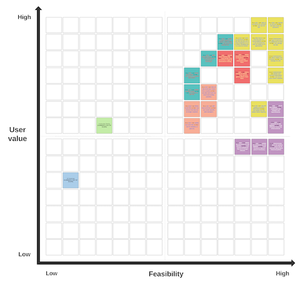

# TRAVEL APPLICATION

# Table Of Contents
- [Travel Application Website Overview](#travel-application-website-overview)
   - [Live Project](#live-project-link-to-live-project)
   - [Project Introduction](#project-introduction)
- [Responsive Review](#responsive-review)
   - [Am I Responsive?](#am-i-responsive-link-to-responsive-review-website)
- [User Experience (UX)](#user-experience-ux)
   - [Website Objectives](#website-objectives)
   - [User Stories](#user-stories)
   - [Website Design](#website-design)
   - [Wireframes](#wireframes)
   - [Features](#...)
- [Further Development](#...)
- [Technologies Used](#...)
   - [Languages Used](#...)
   - [Frameworks, Libraries & Programs Used](#...)
- [Testing](#...)
   - [HTML Validator Results](#...)
   - [CSS Validator Results](#...)
   - [JS Validator Results](#...)
   - [Console Log Warning](#...)
   - [Lighthouse Accessibility Results](#...)
   - [Testing User Stories from User Experience (UX) Section](#...)
   - [Further Testing](#...)
   - [Development Bugs](#...)
   - [Key Learn](#...)
- [Deployment](#...)
   - [Set Up Local GitHub Repository](#...)
   - [Repository Framework](#...)
   - [Update Repository](#...)
   - [GitHub Pages](#...)
- [Credits](#credits)
   - [Development Resources](#development-resources)
   - [Media Resources](#media-resources)
   - [Acknowledgements](#acknowledgements)

 

# Travel Application Website Overview
   ## Live Project [*(link to live project)*](https://traval-app.herokuapp.com/)

   ## Project Introduction
   (**Note:** this is a fictitious client generated for the purpose of developing this project to test my HTML, CSS, Python, JavaScript and Django Framework essentials.)

   This website has been designed to provide users with an easy to use web application to aide in the planning and tacking of travel. The primary objectives of this project are to develop a diary for users to log their travel/holiday experiences whilst also allowing them to mark visited and wish list countries on a map. In addition to these key deliverables the client would also like to provide users with basic country info and an easy to to use travel task manager.

   Following discussions with the client this site will initially be tailored to Europe with the potential to expend the available countries following initial go live. There will also be future opertunities to provide a public blog for users to share their experiences with a wider audience however this is not in scope for the initial launch.

   The client requesting this website is using this as the first step in creating a one stop location for planning and booking holiday and transport needs. The initial goal is to generate user traffic and link in with potential future partners such as booking.com, sectret escapes, kuoni travel, skyscanner to provide a booking platform on a commision based model.

    

# Responsive Review

   ## Am I Responsive? [*(link to responsive review website)*](https://ui.dev/amiresponsive?url=https://traval-app.herokuapp.com/)
   The above provides a view of the login page however login required to view the site contents. This is detailed via screenshots below.

   

      
Login

---
- [All-Devices](readme-assets/responsive/login/login-all.png) 

---
   

   

      
Home

---
- [Desktop 1](readme-assets/responsive/home/home-desktop-1.png) 
- [Desktop 2](readme-assets/responsive/home/home-desktop-2.png) 
- [Desktop 3](readme-assets/responsive/home/home-desktop-3.png) 

---
- [Ipad 1](readme-assets/responsive/home/home-ipad-1.png) 
- [Ipad 2](readme-assets/responsive/home/home-ipad-2.png) 
- [Ipad 3](readme-assets/responsive/home/home-ipad-3.png) 
---
- [Phone 1](readme-assets/responsive/home/home-phone-1.png) 
- [Phone 2](readme-assets/responsive/home/home-phone-2.png) 
- [Phone 3](readme-assets/responsive/home/home-phone-3.png) 
---
   
 

   

      
Profile

---
- [Desktop](readme-assets/responsive/profile/profile-desktop.png) 
- [Ipad](readme-assets/responsive/profile/profile-ipad.png) 
- [Phone](readme-assets/responsive/profile/profile-phone.png) 

---
   

   

      
Site Updates

---
- [All-Devices](readme-assets/responsive/site-updates/site-updates-all.png) 

---
   

   
   

      
Planner

---
- [Desktop](readme-assets/responsive/planner/map-desktop.png) 
- [Ipad](readme-assets/responsive/planner/map-ipad.png) 
- [Phone](readme-assets/responsive/planner/map-phone.png) 

---
   

   

      
Country Info

---
- [Desktop 1](readme-assets/responsive/country-info/country-desktop-1.png) 
- [Desktop 2](readme-assets/responsive/country-info/country-desktop-2.png) 
- [Ipad 1](readme-assets/responsive/country-info/country-ipad-1.png) 
- [Ipad 2](readme-assets/responsive/country-info/country-ipad-2.png) 
- [Phone 1](readme-assets/responsive/country-info/country-phone-1.png) 
- [Phone 2](readme-assets/responsive/country-info/country-phone-2.png) 

---
   

   

      
Task List

---
- [Desktop](readme-assets/responsive/task-list/task-list-desktop.png) 
- [Ipad](readme-assets/responsive/task-list/task-list-ipad.png) 
- [Phone](readme-assets/responsive/task-list/task-list-phone.png) 

---
   

   

      
Diary

---
- [Desktop](readme-assets/responsive/diary/diary-desktop.png) 
- [Ipad](readme-assets/responsive/diary/diary-ipad.png) 
- [Phone](readme-assets/responsive/diary/diary-phone.png) 

---
   

 

# User Experience (UX)

   ## Website Objectives

   

      
Client Goals

   The client wants a simple and engaging website that is easy to use and will result in users returning to the site. 
   * Sleek yet simple UX design.
   * Easy to use functionality.
   * Responsive for any device size to encourage mobile use as well as desktop use.
   * Links to the client's social network accounts to enhance their online presence.
   * Provide a base site to later introduce future partnerships relating to travel and accommodation bookings.
   ---
   

   

      
Visitor Goals

   The visitor should have a clear understanding of what the website purpose is the site functions should encourage regular use.
   * Immediately engaged by the UX design.
   * Understand the purpose of the site.
   * Simple intuitive menu navigation.
   * Intuitive content and links.
   * Ability to view site updates, enhancements and news.
   * Oppertunity to feedback on site updates to drive future improvments to tailor site to user expectations.
   * Easy to access information about countries.
   * Access to a diary to record travel experiences.
   * Access to a task-manager/to-lists to manage travel activities.
   * Readable and aesthetically pleasing on all devices.

   ---
   

   ## User Stories

   All User Stories are detailed on my GitHub account as issues [here](https://github.com/Joe-Collins-1986/travel-app/issues?q=is%3Aissue+is%3Aclosed). 

   These also breakdown:
   - Tasks required for each User Story completion.
   - Acceptance Criteria for each User Story.
   - Unit Testing for each User Story (where applicable)

   ### Summary of User Stories
   

      
Account Management

      
   * As an Administrator I can login in and out of my superuser account so that I can manage the site.
   * As an Administrator I can add or delete user accounts so that I can manage the site.
   * As an Administrator I can update user account information so that I can assist users where required.
   * As a user I can register an account so that I can log in with my password.
   * As a user I can login in and out of my account so that I can use the site.
   * As a user I can reset my password so that I can still use the site if I have forgotten it or if it needs changing due to a security breach.
   * As a Site Owner I can host the site on a cloud platform so that it can accessed by user be scaled up as appropriate.
   ---
   

   

      
Site Updates

   * As an Administrator I can post site updates so that users can be informed about latest features/updates.
   * As a user I can check site updates so that I understand site changes and improvements.
   * As a user I can comment on site updates so that I can influence future site enhancements.
   * As a user I can update my comments on site updates so that I can correct or improve posts if necessary.
   * As a user I can delete my comments on site updates so that i can remove comments that are no longer relevant.
   * As an administrator I can update comments so that I can detail actions taken to resolve issues raised.
   ---
   

   

      
Country Navigation

   
   * As a user I can select countries from a map or dropdown so that I can access information about them.
   * As a user I can mark a country to visited so that I can see at a glance where I have been.
   * As a user I can access basic country info so that I can decide if it is somewhere I might be interested in visiting.
   ---
   

   

      
Profile

   
   * As a user I can see my profile information so that i can confirm if it is correct.
   * As a user I can update my profile info so that it reflects any changes to my circumstances.
   ---
   

   

      
Travel Diary

   * As a user I can create a diary linked to a country I have visited so that I can record my experiences.
   * As a user I can update my diary posts so that I can fix mistakes or add info.
   * As a user I can delete diary posts so that I can remove unwanted information.
   * As a user I can view a list of all the tags added to my diary posts related to the country I am in so that I can search via the tags.
   ---
   

   

      
To-Do Lists

   * As a user I can view all the to-do lists i have for a country so that i can plan and track my travel and holiday activities.
   * As a user I can add new to-do lists so that I can create specific task managers.
   * As a user I can delete to-do lists so that I can remove lists that are no longer required.
   * As a user I can update my to-do lists so that I can fix mistakes or add info.
   ---
   

   

      
To-Do Tasks

   * As a user I can view all items in a to-do list so that I can see what specific activities are required.
   * As a user I can add new to-do items to a list so that I can manage new tasks i consider.
   * As a user I can toggle to-do items to open or closed so that I can see which tasks are outstanding.
   * As a user I can delete to-do items so that I can remove tasks that are no longer required.
   ---
   

   

      
Restrictions

   * As a user I am restricted from specific site updates, map and countries without first logging in so that I can do not try to submit a comment or visited with no user to assign to the object and generate an error.
   * As a user I can restricted from accessing updates and deletion comments created by other users so that no one can update the comment but the user.
   * As a user I am sent to an instructive page when I am unable to access a web page for any reason so that I understand why I am unable to access the page requested.
   ---
   

   ## Website Design

  

      
Colour Scheme

    
   Client requested the site to be built from shades of grey with a bold blue for emphasising key elements. This consideration was made to not pull focus or negativly impact the readability of the site due to its information nature. 

   - Main colours: 
      - #064467 (Dark Blue)
      - #cacaca (Light Grey)
      - #484848 (Dark Grey)
      - #e9e4e4 (Off White)
      - #ffffff (White)

   In additon to the standard colour scheme delete buttons will be marked as red to indicate the risk assosiated with them:

   - Delete colour:
      - #e2110a (Red)

   

   ---
   

   

      
Typography

    
   For the typography the client wanted an easy-to-read text which is fun and engaging. 

   - Title Font and Anchor Tags applied with backup options: 'Lora', serif;
   - Paragraph Font applied with backup options: 'Merriweather', serif;

   ---
   

   

      
Imagery

    
   The images and icons used for development of this website were taken from the below sources. 

   - Flags for counties taken from: https://www.iconfinder.com/flag-icons?price=free
   - Header images for each country. As well as home and login background images and home planner images: https://unsplash.com/
   - Icons: https://fontawesome.com/
   - Favicon: https://pixabay.com/vectors/departures-airport-sign-airliner-153136/

   ---
   

   ## Wireframes

   - [Skeleton Plane](https://www.figma.com/file/a9GzO1BVIhSaGTQPYAINzx/hangman-wireframe-(Skeleton)?node-id=0%3A1)

   - [Surface Plane](https://www.figma.com/file/9w1TswEvWfI4N8Fek3Gocf/hangman-wireframe?node-id=0%3A1)

   **Note:** The structure and wireframes are only to act as a concept and are subject to change as the website development evolves in collaboration with the client.

   ## Features

   ### **Features planning**

   

      
Problem Statement

    

   Following discusions with a focus group the following problem statment was developed alongside potential overarching features to satisfy user expectations.

   
    
   If you have a LucidChart account, you can also view this Mind-Map [here](https://lucid.app/lucidspark/7a7db2c4-0ae5-4daf-9919-ac0871afd80f/edit?view_items=-9MgloYgLC6R&invitationId=inv_1dd18ca7-574f-4e19-9df3-fe768b642e93).
    

   ---

   

   

      
Mind-Map

    

   The below image provides an initial mind-map into the features which might be appropriate for the travel application based on the problem statement. This will aide in the development of user stories.

   
    
   If you have a LucidChart account, you can also view this Mind-Map [here](https://lucid.app/lucidspark/8cd26622-1780-4fc3-85fa-28ced47687a8/edit?viewport_loc=-1468%2C-60%2C4105%2C2018%2C0_0&invitationId=inv_ceff3ba6-bc74-4fe6-ba65-aafecb2c6d31).
    

   ---

   

   

      
Priority Matrix

    

   The below maps out the feasibility of the features considered against the user value they provide to help establish the priority they have as part of the build.

   
    
   
    
   If you have a LucidChart account, you can also view this priority matrix [here](https://lucid.app/lucidspark/2023f4b5-b0e3-4be5-b188-562b2ee292d7/edit?viewport_loc=-2222%2C-1006%2C16387%2C8543%2C0_0&invitationId=inv_12794b38-9259-4f4a-bba2-59feacd478f0).
    

   ---

   

   

      
Process Flow

    

   The below details the process flow for the game from beginning to end.

    
   If you have a LucidChart account, you can also view this process flow [here](https://lucid.app/lucidchart/45f9a33d-bf6a-431b-8cb7-6cf56aced5a6/edit?viewport_loc=-279%2C-45%2C4992%2C2589%2CI~k5YlUlNz8V&invitationId=inv_e8867747-9ada-4d1d-9cd3-f40d4cf76206).
    

   ---

   

   

      
Functions Flow

    

   The below demonstrates the key game functions and how they interact with each other. It also details the inclusion of the Gameplay class.

    
   If you have a LucidChart account, you can also view this functions flow [here](https://lucid.app/lucidchart/6f4a551a-5f6e-43eb-9645-1834994d4e27/edit?viewport_loc=-391%2C-96%2C4221%2C2189%2CMrp4u2cXQ7zq&invitationId=inv_4642de00-28f1-4eff-8cd1-fe81b08e943d).
    

   ---
   
   

   

      
Class Requirements

    

   The below breaks down the Gameplay class detailing it's purpose, class variables and methods.

    
   If you have a LucidChart account, you can also view this class requirements [here](https://lucid.app/lucidchart/6f4a551a-5f6e-43eb-9645-1834994d4e27/edit?viewport_loc=-1010%2C-180%2C3889%2C2017%2CVWq4R58lY_hn&invitationId=inv_4642de00-28f1-4eff-8cd1-fe81b08e943d).
    

   ---
   
   

   ### **Features breakdown**

   Each section below will detail their specific function.
   

   

      
Random Word

    

   #### Random word selected from list
   There will be 3 lists in this game:

   1. animals
   2. cars
   3. countries
   
   Dependent on the topic selected the random word will be taken from the appropriate list. 
   
   If the user selects play again the word will be removed from the list so that it cannot be duplicated.
    

   ---

   

   

         
Present Word

    
   
   #### Empty word
   At the commencement of the game there is a function to locate a random word from a list (dependent on topic selected) and present as underscores.

   
    

   ---

   #### Guessed letter
   If the user's guess is in the randomly selected word the letter will appear as well as encouraging words on the screen.

   
    
   
   ---

   #### Guessed incorrect letter
   If the user's guess is not in the randomly selected word the underscore will remain as well words informing the user the answer is incorrect.
   
   It will also result in a hangman element being drawn and the potential winning score being reduced.

   
    
   
   ---
   

   

      
Select Letters

    

   #### Letters selected are checked against word
   The letter selected will be checked against the randomised word to see if it appears. If it does it will run success outcomes if it does not it will run fail outcomes. It will also update the presented word on the screen to incorporate correctly guessed letters.
    

   ---

   #### Letters fade after use
   After a letter is selected it will fade and be deactivated.

   
    

   ---

   #### On game completion deactivate all letters
   After the game is won or lost no letter buttons will be active. This is to stop any further amendments to the score.  
   The letters will not fade, they will just be deactivated.
    

   ---

   

 
   

      
Hangman Drawing

    

   #### Incorrect answers draw hangman element
   On incorrect guess a hangman element will be drawn. This is done using canvas in JS.

   
    

   ---

   #### On game completion hangman section will be replaced with outcome
   The div holding the hangman image will also be used to detail if the user has won or lost on game completion.

   
    

   ---
   
    

   If reset is selected the webpage will refresh which will reset all variable and the game will start again at a score of 0.

   If play again is selected the required variable will be resent in JS leaving the score to accumulate.
    

   ---

   

   

      
Rules

    

   #### Rules held on index page
   The rules content will be kept on the same page at the rest of the web content. This is to ensure the score is retained as backend data storage is not in use for this project.

   A scroll feature was added to the rules to post-it to keep the sizing consistent.

   
    

   
    

   ---

   

   

      
Settings

    

   #### Settings held on index page
   The settings content will be kept on the same page at the rest of the web content. This is to ensure the score is retained as backend data storage is not in use for this project.

   A scroll feature was added to the settings to post-it to keep the sizing consistent. This will only appear if required on small screens.

   
    

   ---

   #### Allow change in topic
   Within settings it will be possible to change the topic. This will change the list the randomised word is selected from and will also present the currents topic onto the html page.

   (See screenshot above)
    

   ---

   #### Toggle audio
   Within settings it will be possible to toggle the audio on and off. As per best practice this will be set to mute as default.

   (See screenshot above)
    

   ---

   

   

      
Score

    

   #### Score increase
   Set to increase the score dependent on how many incorrect answers the user makes.

   Potential score starts at 10 each game and reduces by 1 for each incorrect letter guessed.

   
    

   ---

   #### Score decrease
   If the user does not guess the word in 10 attempts, then their score will reduce by 5 points. This has the potential to take the users overall score into a negative figure.

   
    

   ---

   #### Score accumulation
   If the user opts to play again their score will be retained from the previous games with the new score being added.

   
    

   ---

   

   

      
Social Media Links

    

   #### Present links to social media platforms
   The links provided will take the user to the social media platforms but not to active accounts. This is because the client is fictional and does not have real accounts.

   

   

   

    

# Further Development
   * Add additional categories to the hangman game.
   * Use web scraping to generate full word lists for future categories.
   * Add optional timer to game.
   * Provide language options to game.
   * Retain scores using back-end development to provide a scoreboard for users.
   * Add additional games.
   * Add advertisements to site to generate revenue.
   
    

# Technologies Used

   ## Languages Used

   - HTML
   - CSS
   - JavaScript

   ## Frameworks, Libraries and Programs Used

   1. Google Fonts:
      - Used to obtain appropriate fonts to use in website not held as standard.
   2. Font Awesome:
      - Used to obtain several icons used to improve the visuals of the website.
   3. Git:
      - Used for version control and to Push to GitHub.
   4. GitHub:
      - Used to store and share the code as well as publish to live website.
   6. Figma:
      - Used to plan out website format.
   7. Web Developer:
      - Used to analyse HTML, CSS and JavaScript output and correct where required.
   8. Canvas:
      - Used to draw the hangman on JS.

    

# Testing
   ## HTML Validator Results: 
   - [HTML index page](https://validator.w3.org/nu/?showsource=yes&doc=https%3A%2F%2Fjoe-collins-1986.github.io%2FHangman%2F)

   

      
HTML Issue Resolutions

   ### Warnings
   Following the HTML validation, the following warnings were identified and addressed.

   

   ---

   #### **Resolutions**
   **Points 1 - 2:**
   These were initially implemented as li items acting as a menu option directing to additional content. However, removed aria-label following best practice due to no href.

   ---

   **Points 3 - 7:**
   All ID first occurrences were addressed by changing duplicate IDs to classes.

   ---

   **Points 8:**
   Placed empty quotes into h2 space to remove error. This header is produced by JS.

   ---

   ### Errors
   Following the HTML validation, the following errors were identified and addressed.

   

   ---

   #### **Resolutions**
   **Point 1:**
   Delete stray div tag.

   ---

   **Points 2 - 6:**
   - Replace IDs with Classes and update CSS to .element as opposed to #element.
   - Checked ID was not used in JS.
   - Removed duplicate class syntax e.g. class="settings-pin" class="pin-right". This was changed to class=”settings-pin pin-right”.

   ---

   **Points 7 - 10:**
   Mute is defaulted as true so no need to specify. Therefore removed = “true”.

   ---
   

   ## CSS Validator Results
   - [CSS validator results](https://jigsaw.w3.org/css-validator/validator?uri=https%3A%2F%2Fjoe-collins-1986.github.io%2FHangman%2F&profile=css3svg&usermedium=all&warning=1&vextwarning=&lang=en)

   

      
CSS Issue Resolutions

   ### Warnings & errors
   Following the CSS validation, the following warnings and errors were identified and addressed.

   

   ---

   **Points 1 - 2:**
   Removed unnecessary semi-colon.

   ---

   **Warning Provided:** 'Imported style sheets are not checked in direct input and file upload modes'.

   **Stack Overflow Response to Warning:** You're just trying to validate your CSS file using the W3C validator, and it's letting you know that it's not going to validate the imported style sheet (Google's). It's not an error, just some information for you.

   ---
   

   ## JS Validator Results
   

   

      
JS Issue Resolutions

   ### Errors
   Following the JS validation the following errors were identified and addressed.

   **Points - define variables:**  
   

   Errors resolved by declaring i in the relevant for loops.

   ---

   **Points - template literal syntax:**  
   

   Cause by use of Font Awesome. no detriment to usage. Site functioning as expected. Following consultation with my mentor no action was required.

   ---

   **Points - functions declared within loops referencing an outer scoped variable:**  
   

   Utilising outer scoped variables. No issues caused by this, and maintenance is acceptable. Following consultation with my mentor no action was required.

   ---

   **Points - expected a conditional expression and instead saw an assignment.:**  
   

   Functions built with if statements, with no else option. No errors occurring. Following consultation with my mentor no action was required.

   ---

   **Points - level not defined.:**  
   

   HTML ID not defined as a variable. Created a variable for this and stored as level.

   ---

   **Points - 	'i' is not defined.:**  
   

   Declare i as a variable.

   

   ## Console Log Warning
   

   

      
Console Log Warning Review

   On refreshing the page a warning was highlighted on the console log. I used Stack Overflow to investigate the potential impact of this warning.

   Stack Overflow findings:

      Basically you can ignore it. GitHub hosted pages disable FLoC, which is Google's 3rd party cookie alternative. GitHub, Microsoft, doesn't seems to like it.

   Following this review and consultation with my mentor no action was required for this warning.

   

   

   ## Lighthouse Accessibility Results:
   

   ## Testing User Stories From User Experience (UX) Section

   

      
Client Goals

   The client wants a simple and engaging game that is easy to use and will result in users returning to the site. 
   * Sleek yet simple UX design.
      - **REVIEW - UX design kept minimalist. Simple, clear colour scheme with engaging visuals to make the page look like it is being completed on a notepad as one might historically play hangman.**
   * Easy to use functionality.
      - **REVIEW - Simple intuitive buttons/functions. Built without overcomplicating and game requirements. All built on one page for simplicity.**
   * Responsive for any device size to encourage mobile use as well as desktop use.
      - **REVIEW - Built with responsive design for all devices. Structure of page amended to best suit the appropriate device size.**
   * Links to the client's social network accounts to enhance their online presence.
      - **REVIEW - Social network links located in footer with clear recognisable images.**
   * Addictive gameplay to encourage return clients and drive positive word of mouth to encourage new users.
      - **REVIEW - Used feedback from testers to build a game which has been well received with testers re-using for their own enjoyment.**
   
   ---
   

   

      
Client Future Goals

   
   Points to consider for future development:
   * Additional words and topics to be added to the hangman game.
      - **REVIEW - Option to add additional lists to the game and increase the existing lists. Code written to make this addition easy to implement.**
   * Allow for scores to be recorded and stored into a leader board.
      - **REVIEW - For future enhancements utilising back-end development, it would be good to store user data and scores to generate a leader board encouraging re-use and competition between users.**
   * Additional games and puzzles added to the site.
      - **REVIEW - Use the site to develop a range of similar games with a consistent aesthetic appeal.**
   * Generate advertisement revenue through the site.
      - **REVIEW - Once web traffic is sufficient use the site to advertise products and services. This must be done in a way to minimise the negative impact on user experience.**

   ---
   

   

      
First-Time Visitor Goals

   * Immediately engaged by the UX design.
      - **REVIEW - Engaging gameplay and visuals developed based on user feedback to ensure an immediate and continued interest in the game.**
   * Understand the purpose of the site.
      - **REVIEW - Very clear game purpose and easy to locate and read rules where required.**
   * Simple intuitive menu navigation.
      - **REVIEW - Menus built to stand out using colour differentiation. Always easily identified on the screen.**
   * Intuitive content and links to social media.
      - **REVIEW - Social Media links easily identifiable and located on the screen.**
   * Readable and aesthetically pleasing on all devices.
      - **REVIEW - Game structure amended to best present on each device size. Smooth responsive alterations on reducing screen size.**

   ---
   

   

      
Returning Visitor Goals

   
   * Revisit to replay game to try different topics.
      - **REVIEW - Multiple topics generated to keep people of different interests engaged. On completion of a topic, it will be unusable (until game reset) giving the user a feeling of accomplishment.**
   * Revisit to replay game to beat previous score.
      - **REVIEW - Accumulating score gives a challenge to users to see how high a score they can generate and try to beat this on re-visits.**
   * Revisit to locate social media links to client.
      - **REVIEW - Social Media links available for anyone trying to link in with the client (These are not set to real accounts for this project due to a fictional client).**

   

   ## Further Testing
   * Tested across Google Chrome, Safari, Microsoft Edge, Fire Fox browsers on both Mac and Windows.
   * Viewed on a variety of devices using Web Developer Tools as well as several live desktop, iPad and mobile devices. 
   * Each page tested by developer and friends to ensure functionality worked as expected.
   * Issued to Slack community to review and provide feedback on.

   ## Development Bugs

   

      
Menu Toggle Issue

   
   On closing settings or rules using the close button on a small screen the menu remains open. I want this to close to improve aesthetics and reduce required button clicks when returning to game.

   

   

   Image shows that after ‘Leave Settings’ is selected the menu remains on screen until the ? icon is selected again.

   Another issue this caused was that if the rules or settings content were opened on a small screen and the ? icon was clicked it would toggle the menu off and need to be clicked again to open the menu options.

   The final issue with the toggle option on the ? icon was that when it was set to on and the screen size was changed to large, when rules or settings were opened and the screen was returned to small the menu overlapped the rules or settings content.

   

   Image shows the menu overlapping rules and settings content.

   By adding the matchMedia code and moving the rules and settings in front of the small screen menu with a CSS z-index of 2 the functionality works as intended.
   
    

   **Code block to resolve:**

      if (matchMedia("(min-width: 821px)").matches) {
            postIt.className = "post-it-contents";
      }
      else {
            postIt.classList.toggle("select");
      }

   ___

   

   

      
Canvas Re-Size

   
   When I initially drew the hangman on the canvas, I had an issue if the screen was re-sized. The image would not re-size along with it.

   By implementing an event listener for window re-size and calculating the canvas images based on a percentage of the canvas height and width I was able to resolve this issue.

   

   Image shows canvas not re-sizing to match screen change.
  
    

   **Code block to resolve:**

      window.addEventListener("resize", function() {
        canvas.width = canvasSize.clientWidth;
        canvas.height = canvasSize.clientHeight;
        hangmanDraw();
      });

   The above code block shows how when the screen size is changed the canvas re-sizes and redraws the required elements.

      function drawBase() {
        ctx.fillRect(canvas.width * 0.2, canvas.height * 0.9, canvas.width * 0.6, 5);
      }
   
   The above code block shows a canvas element calculated based on canvas dimensions.

   ___

   

   

      
Underscore Overlap

   
   When testing the game, it was identified that for long words the underscores overlapped the word output container.

   

   However, when some of the letters were presented as text it did not.

   

   I identified that this was because in the JS code I had put spaces around the underscores. However, I had also set the CSS word output to have a letter spacing of 0.8rem.
  
    

   **Code blocks detailing issue:**

   JS code:

      function underscoreWord() {
         for (let i = 0; i < selectedWord.length; i++) { 
            shownWord[i] = " _ "; //remove spaces from around the underscore
            }
        
            wordOutput.innerHTML = shownWord.join(" ");
         }
   
   CSS code:

      #word-output {
         height: 54px;
         display: flex;
         justify-content: center;
         align-items: center;
         font-size: 2rem;
         font-weight: bold;
         letter-spacing: .8rem; // already has spacing between letters
         background-color: white;
         border: 2px solid black;
         border-radius: 1.2rem;
         margin-bottom: 27px;
      }

   By removing the spacing from the underscore in the JS code, it resolved the issue. 

   Despite this I later decided to make the maximum word length 6 letters. This was because when the text size was reduced to fit the output container for a small screen it was becoming challenging to read the letters.

   In future developments the word output container could be increased to allow for longer words and potentially sentences. 

   

   

   ## Key Learn
   The main key learn I took from this project was to build the readme file in conjunction with the website development.

   I was not sure if the design and functionality were feasible for the development of this project given my limited experience in CSS and JS. Therefore, I spent a lot of time building it in a test environment before deciding I could accomplish the desired result.

   By the time I had realised it was feasible I had completed a lot of the work. As a result of this I had to retrospectively complete sections of the readme file which would have been better suited to completing at the scoping, researching and initial build stages.

   Despite this I feel that I did a good job recording my progress through easy-to-understand concise commits which made it easier to revisit certain elements of the project where necessary.

    

# Deployment
   ## Set Up Local GitHub Repository
   1. Go to https://github.com/Code-Institute-Org/gitpod-full-template.
   2. Select use this template.
   3. Add repository name within my GitHub. (This will generate a repository in my Git Hub with the appropriate files.)

   ## Repository Framework
   1. Select the repository on GitHub and open with GitPod (green button).
   2. Create required html page.
   3. Create assets folder.
   4. Within assets folder create CSS folder, images folder, JS folder & readme-assets folder.
   5. Add required files to folders including style.css, images, script.js, etc.

   ## Update Repository
   1. When adding a new feature create a separate branch to work in safely typing into the terminal "git branch 'name of required feature/update'".
   2. Checkout the branch with "git checkout 'name of required feature/update'".
   3. Make updates and test using "python -m http.server".
   4. Once testing is complete add to Git staging area using "git add ."
   5. Commit the changes and add a useful explanation of what action was done to track the history in GitHub using "git commit -m 'explanation of update'".
   6. Once the feature is complete, fully tested, and ready to be added to the main branch first go to the main branch using "git checkout main".
   7. Merge the feature branch into the main using "git merge 'name of required feature/update'".
   8. Confirm merge was successful and then if it is not going to be re-used delete the feature branch using "git branch -d 'name of required feature/update'". (If deleting a branch with commits not merged to main delete with -D instead of -d)
   9. Use "git push" to push the commits to GitHub. These will then appear in the live website if it has been set up in GitHub Pages.

   ## GitHub Pages
   Deploy in GitHub Pages:
   1. Log in to my GitHub and go to my appropriate repository.
   2. Access settings.
   3. Under 'Code and Automation' go to pages.
   4. Leave the source as Deploy from Branch.
   5. Set Branch to Main.
   6. Save.
   7. Give GitHub a few minutes and the live URL is provided at the top of the GutHub Pages section of settings.
   8. Any Git Pushes from the terminal whilst working on the repository using GitPod will now update in this live site.

    

# Credits
   ## Development Resources
   The following sources acted as guidance for understanding. No code was taken directly for use in this project.

   * Learning how to use linear gradients. This was used to develop the look of a notepad with re-occurring lines. (https://www.w3schools.com/css/css3_gradients.asp), (https://codepen.io/ceg9498/post/creating-lined-paper)
   * FlexBox guidance/re-fresh. (https://css-tricks.com/snippets/css/a-guide-to-flexbox/)
   * Intro to canvas in JS to create the hangman image. (https://developer.mozilla.org/en-US/docs/Web/API/Canvas_API/Tutorial)
   * Canvas responsive. (https://stackoverflow.com/questions/34772957/how-to-make-canvas-responsive)
   * Clearing the canvas. (https://stackoverflow.com/questions/2142535/how-to-clear-the-canvas-for-redrawing)
   * Understanding event listeners. (https://www.w3schools.com/js/js_htmldom_eventlistener.asp)
   * Change mouse pointer on hover for menu list items (https://www.w3schools.com/cssref/pr_class_cursor.asp)
   * Understand the toggle class method to utilise in menu activation. (https://www.w3schools.com/howto/howto_js_toggle_class.asp)
   * Set JS rules dependent on-screen size. (https://www.w3schools.com/jsrEF/met_win_matchmedia.asp)
   * Wrap entire game in an initialise function to eliminate global variables. (https://www.youtube.com/watch?v=_4V4yUxGng8)
   * Stack Overflow used for generalised queries during development.

   ## Media Resources
   * All images were obtained from Unsplash.
      - Image for the background wood effect (jon-moore-5fIoyoKlz7A-unsplash.jpg).
      - Image of the mountain doodle which shows on large screen viewings (nicolas-pinilla-GcDr6ZIzbIw-unsplash.jpg).
   * Audio was taken form YouTube videos
      - Sound on correct answer. (https://www.youtube.com/watch?v=403gX7TnhTQ)
      - Sound on incorrect answer. (https://www.youtube.com/watch?v=RZEsfS1rGyY) - modified using Audacity
      - Sound on getting word correct. (https://www.youtube.com/watch?v=ytjxf9YNJ-0) - modified using Audacity
      - Sound on getting word incorrect. (https://www.youtube.com/watch?v=na-a3lLB13Q&t=16s) - modified using Audacity

   ## Acknowledgements
   * Thank to my Mentor (Spencer Barriball) for his feedback and guidance.
   * The Code Institute Slack community for helping with any and all queries.