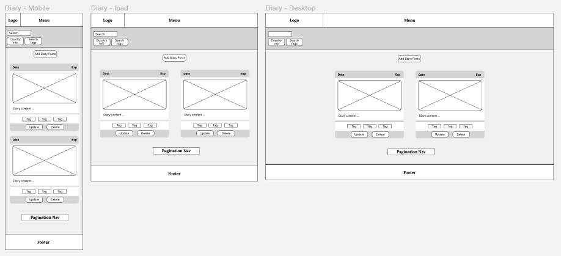
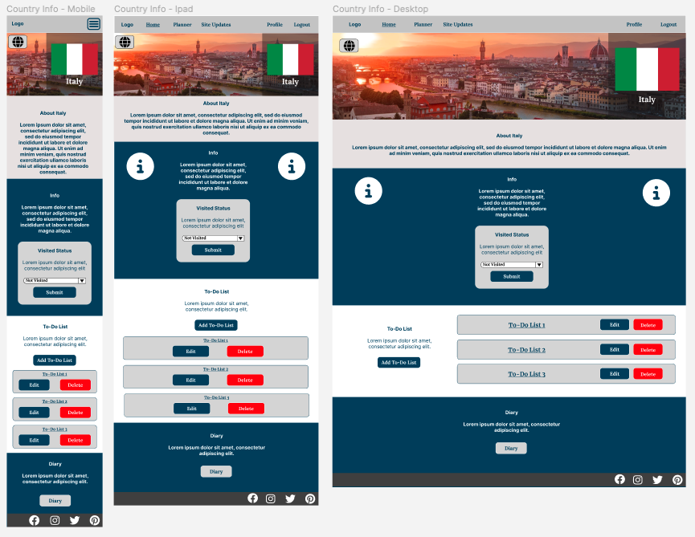
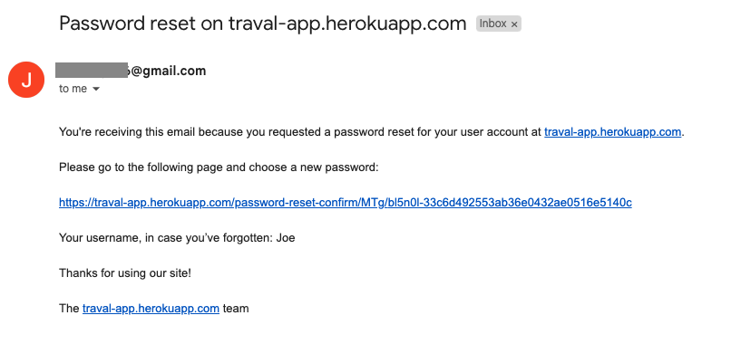
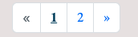

# TRAVEL APPLICATION

TO DO:
 - ADD LOGO TO WEB DESIGN

 - Development Bugs
 - Key Learns
 - Credits

# Table Of Contents
- [Travel Application Website Overview](#travel-application-website-overview)
   - [Live Project](#live-project-link-to-live-project)
   - [Project Introduction](#project-introduction)
- [Responsive Review](#responsive-review)
   - [Am I Responsive?](#am-i-responsive-link-to-responsive-review-website)
- [User Experience (UX)](#user-experience-ux)
   - [Website Objectives](#website-objectives)
   - [User Stories](#user-stories)
   - [Website Design](#website-design)
   - [Wireframes](#wireframes)
   - [Features](#features)
- [Further Development](#further-development)
- [Technologies Used](#technologies-used)
   - [Languages Used](#languages-used)
   - [Frameworks Used](#frameworks-used)
   - [Libraries Used](#libraries-used)
   - [Developer Tools](#developer-tools)
- [Testing](#testing)
   - [Testing Document](#testing-document)
   - [Further Testing](#further-testing)
   - [Development Bugs](#development-bugs)
   - [Key Learns](#key-learns)
- [Deployment](#deployment)
   - [Deployment Document](#deployment-document)
- [Credits](#credits)
   - [Development Resources](#development-resources)
   - [Media Resources](#media-resources)
   - [Acknowledgements](#acknowledgements)

 

# Travel Application Website Overview
   ## Live Project [*(link to live project)*](https://traval-app.herokuapp.com/)

   ## Project Introduction
   (**Note:** this is a fictitious client generated for the purpose of developing this project to test my HTML, CSS, Python, JavaScript and Django Framework essentials.)

   This website has been designed to provide users with an easy to use web application to aide in the planning and tracking of travel. The primary objectives of this project are to develop a diary for users to log their travel/holiday experiences whilst also allowing them to mark visited and wish list countries on a map. In addition to these key deliverables the client would also like to provide users with basic country info and an easy to to use travel task manager.

   Following discussions with the client this site will initially be tailored to Europe with the potential to expand the available countries following initial go live. There will also be future opertunities to provide a public blog for users to share their experiences with a wider audience however this is not in scope for the initial launch.

   The client requesting this website is using this as the first step in creating a one stop location for planning and booking holiday and transport needs. The initial goal is to generate user traffic and link in with potential future partners such as Booking.com, Secret Escapes, Kuoni Travel, Skyscanner to provide a booking platform on a commision based model.

    

# Responsive Review

   ## Am I Responsive? [*(link to responsive review website)*](https://ui.dev/amiresponsive?url=https://traval-app.herokuapp.com/)
   The above provides a view of the login page however login is required to view the site contents. These are detailed via screenshots below.

   

      
Login

---
- [All-Devices](readme-assets/responsive/login/login-all.png) 

---
   

   

      
Home

---
- [Desktop 1](readme-assets/responsive/home/home-desktop-1.png) 
- [Desktop 2](readme-assets/responsive/home/home-desktop-2.png) 
- [Desktop 3](readme-assets/responsive/home/home-desktop-3.png) 

---
- [Ipad 1](readme-assets/responsive/home/home-ipad-1.png) 
- [Ipad 2](readme-assets/responsive/home/home-ipad-2.png) 
- [Ipad 3](readme-assets/responsive/home/home-ipad-3.png) 
---
- [Phone 1](readme-assets/responsive/home/home-phone-1.png) 
- [Phone 2](readme-assets/responsive/home/home-phone-2.png) 
- [Phone 3](readme-assets/responsive/home/home-phone-3.png) 
---
   
 

   

      
Profile

---
- [Desktop](readme-assets/responsive/profile/profile-desktop.png) 
- [Ipad](readme-assets/responsive/profile/profile-ipad.png) 
- [Phone](readme-assets/responsive/profile/profile-phone.png) 

---
   

   

      
Site Updates

---
- [All-Devices](readme-assets/responsive/site-updates/site-updates-all.png) 

---
   

   
   

      
Planner

---
- [Desktop](readme-assets/responsive/planner/map-desktop.png) 
- [Ipad](readme-assets/responsive/planner/map-ipad.png) 
- [Phone](readme-assets/responsive/planner/map-phone.png) 

---
   

   

      
Country Info

---
- [Desktop 1](readme-assets/responsive/country-info/country-desktop-1.png) 
- [Desktop 2](readme-assets/responsive/country-info/country-desktop-2.png) 
- [Ipad 1](readme-assets/responsive/country-info/country-ipad-1.png) 
- [Ipad 2](readme-assets/responsive/country-info/country-ipad-2.png) 
- [Phone 1](readme-assets/responsive/country-info/country-phone-1.png) 
- [Phone 2](readme-assets/responsive/country-info/country-phone-2.png) 

---
   

   

      
Task List

---
- [Desktop](readme-assets/responsive/task-list/task-list-desktop.png) 
- [Ipad](readme-assets/responsive/task-list/task-list-ipad.png) 
- [Phone](readme-assets/responsive/task-list/task-list-phone.png) 

---
   

   

      
Diary

---
- [Desktop](readme-assets/responsive/diary/diary-desktop.png) 
- [Ipad](readme-assets/responsive/diary/diary-ipad.png) 
- [Phone](readme-assets/responsive/diary/diary-phone.png) 

---
   

 

# User Experience (UX)

   ## Website Objectives

   

      
Client Goals

   The client wants a simple and engaging website that is easy to use and will result in users returning to the site. 
   * Sleek yet simple UX design.
   * Easy to use functionality.
   * Responsive for any device size to encourage mobile use as well as desktop use.
   * Links to the client's social network accounts to enhance their online presence.
   * Provide a base site to later introduce future partnerships relating to travel and accommodation bookings.
   ---
   

   

      
Visitor Goals

   The visitor should have a clear understanding of what the website purpose is and the site functions should encourage regular use.
   * Immediately engaged by the UX design.
   * Understand the purpose of the site.
   * Simple intuitive menu navigation.
   * Intuitive content and links.
   * Ability to view site updates, enhancements and news.
   * Opportunity to feedback on site updates to drive future improvments to tailor site to user expectations.
   * Easy to access information about countries.
   * Access to a diary to record travel experiences.
   * Access to a task-manager/to-lists to manage travel activities.
   * Readable and aesthetically pleasing on all devices.

   ---
   

   ## User Stories

   All User Stories are detailed on my GitHub account as issues [here](https://github.com/Joe-Collins-1986/travel-app/issues?q=is%3Aissue+is%3Aclosed). 

   These also breakdown:
   - Tasks required for each User Story completion.
   - Acceptance Criteria for each User Story.
   - Unit Testing for each User Story (where applicable)

   ### Summary of User Stories
   

      
Account Management

      
   * As an Administrator I can login in and out of my superuser account so that I can manage the site.
   * As an Administrator I can add or delete user accounts so that I can manage the site.
   * As an Administrator I can update user account information so that I can assist users where required.
   * As a user I can register an account so that I can log in with my password.
   * As a user I can login in and out of my account so that I can use the site.
   * As a user I can reset my password so that I can still use the site if I have forgotten it or if it needs changing due to a security breach.
   * As a Site Owner I can host the site on a cloud platform so that it can be accessed by user be scaled up as appropriate.
   ---
   

   

      
Site Updates

   * As an Administrator I can post site updates so that users can be informed about latest features/updates.
   * As a user I can check site updates so that I understand site changes and improvements.
   * As a user I can comment on site updates so that I can influence future site enhancements.
   * As a user I can update my comments on site updates so that I can correct or improve posts if necessary.
   * As a user I can delete my comments on site updates so that I can remove comments that are no longer relevant.
   * As an administrator I can update comments so that I can detail actions taken to resolve issues raised.
   ---
   

   

      
Country Navigation

   
   * As a user I can select countries from a map or dropdown so that I can access information about them.
   * As a user I can mark a country to visited so that I can see at a glance where I have been.
   * As a user I can access basic country info so that I can decide if it is somewhere I might be interested in visiting.
   ---
   

   

      
Profile

   
   * As a user I can see my profile information so that I can confirm if it is correct.
   * As a user I can update my profile info so that it reflects any changes to my circumstances.
   ---
   

   

      
Travel Diary

   * As a user I can create a diary linked to a country I have visited so that I can record my experiences.
   * As a user I can update my diary posts so that I can fix mistakes or add info.
   * As a user I can delete diary posts so that I can remove unwanted information.
   * As a user I can view a list of all the tags added to my diary posts related to the country I am in so that I can search via the tags.
   ---
   

   

      
To-Do Lists

   * As a user I can view all the to-do lists I have for a country so that i can plan and track my travel and holiday activities.
   * As a user I can add new to-do lists so that I can create specific task managers.
   * As a user I can delete to-do lists so that I can remove lists that are no longer required.
   * As a user I can update my to-do lists so that I can fix mistakes or add info.
   ---
   

   

      
To-Do Tasks

   * As a user I can view all items in a to-do list so that I can see what specific activities are required.
   * As a user I can add new to-do items to a list so that I can manage new tasks I consider.
   * As a user I can toggle to-do items to open or closed so that I can see which tasks are outstanding.
   * As a user I can delete to-do items so that I can remove tasks that are no longer required.
   ---
   

   

      
Restrictions

   * As a user I am restricted from specific site updates, map and countries without first logging in so that I can do not try to submit a comment or visited with no user to assign to the object and generate an error.
   * As a user I am restricted from accessing updates and deletion comments created by other users so that no one can update the comment but the author.
   * As a user I am sent to an instructive page when I am unable to access a web page for any reason so that I understand why I am unable to access the page requested.
   ---
   

   ## Website Design

  

      
Colour Scheme

    
   Client requested the site to be built from shades of grey with a bold blue for emphasising key elements. This consideration was made to not pull focus or negatively impact the readability of the site due to its information nature. 

   - Main colours: 
      - #064467 (Dark Blue)
      - #cacaca (Light Grey)
      - #484848 (Dark Grey)
      - #e9e4e4 (Off White)
      - #ffffff (White)

   In additon to the standard colour scheme delete buttons will be marked as red to indicate the risk assosiated with them:

   - Delete colour:
      - #e2110a (Red)

   

   ---
   

   

      
Typography

    
   For the typography the client wanted an easy-to-read text which is fun and engaging. 

   - Title Font and Anchor Tags applied with backup options: 'Lora', serif;
   - Paragraph Font applied with backup options: 'Merriweather', serif;

   ---
   

   

      
Imagery

    
   The images and icons used for development of this website were taken from the below sources. 

   - Flags for counties taken from: https://www.iconfinder.com/flag-icons?price=free
   - Header images for each country as well as home and login background images and home planner images: https://unsplash.com/
   - Icons: https://fontawesome.com/
   - Favicon: https://pixabay.com/vectors/departures-airport-sign-airliner-153136/

   ---
   

   

      
Logo

    
   Client provided the Logo they wish to see on the site.
     

   

   ---
   

   ## Wireframes

   ### Skeleton Plane

   [Skeleton Plane - Figma Link](https://www.figma.com/file/Sbio9RON3TWhozD0Jkmjun/Travel-Planner---Skeleton-Plane?node-id=106-2&t=A0em54x0gFCE78ZA-0)

   

      
Skeleton Screenshots

   Login/Register/Reset Password: 
    

   ---

   Home: 
    

   ---

   Map: 
    

   ---

   Country Info: 
    

   ---

   List: 
    

   ---

   Diary: 
    

   ---

   Tags: 
    

   ---

   Site Updates: 
    

   ---

   Update: 
    

   ---

   Forms: 
    

   

   ---

   ### Surface Plane

   [Surface Plane - Figma Link](https://www.figma.com/file/fJL1wMXqAOuVchpzWhpWzF/Travel-Planner---Surface-Plane?node-id=102-1169&t=A0em54x0gFCE78ZA-0)

   

      
Surface Screenshots

   Login/Register/Reset Password: 
    

   ---

   Home: 
    

   ---

   Map: 
    

   ---

   Country Info: 
    

   ---

   List: 
    

   ---

   Diary: 
    

   ---

   Tags: 
    

   ---

   Site Updates: 
    

   ---

   Update: 
    

   ---

   Forms: 
    

   

   ---

   **Note:** The structure and wireframes are only to act as a concept and are subject to change as the website development evolves in collaboration with the client.

   ## Features

   ### **Features planning**

   

      
Problem Statement

    

   Following discussions with a focus group the following problem statement was developed alongside potential overarching features to satisfy user expectations.

   
    
   If you have a LucidChart account, you can also view this Mind-Map [here](https://lucid.app/lucidspark/7a7db2c4-0ae5-4daf-9919-ac0871afd80f/edit?view_items=-9MgloYgLC6R&invitationId=inv_1dd18ca7-574f-4e19-9df3-fe768b642e93).
    

   ---

   

   

      
Mind-Map

    

   The below image provides an initial mind-map into the features which might be appropriate for the travel application based on the problem statement. This will aide in the development of User Stories.

   
    
   If you have a LucidChart account, you can also view this Mind-Map [here](https://lucid.app/lucidspark/8cd26622-1780-4fc3-85fa-28ced47687a8/edit?viewport_loc=-1468%2C-60%2C4105%2C2018%2C0_0&invitationId=inv_ceff3ba6-bc74-4fe6-ba65-aafecb2c6d31).
    

   ---

   

   

      
Priority Matrix

    

   The below maps out the feasibility of the features considered against the user value they provide to help establish the priority they have as part of the build.

   
    
   
    
   If you have a LucidChart account, you can also view this priority matrix [here](https://lucid.app/lucidspark/2023f4b5-b0e3-4be5-b188-562b2ee292d7/edit?viewport_loc=-2222%2C-1006%2C16387%2C8543%2C0_0&invitationId=inv_12794b38-9259-4f4a-bba2-59feacd478f0).
    

   ---

   

   

      
Process Flow

    

   The below details the process flow for travel application.

    
   If you have a LucidChart account, you can also view this process flow [here](https://lucid.app/lucidchart/45f9a33d-bf6a-431b-8cb7-6cf56aced5a6/edit?viewport_loc=-279%2C-45%2C4992%2C2589%2CI~k5YlUlNz8V&invitationId=inv_e8867747-9ada-4d1d-9cd3-f40d4cf76206).
    

   ---

   

   

      
DataBase ER Diagram

    

   The below demonstrates the site models and their attributes as well as documenting how they interact.

    
   If you have a LucidChart account, you can also view this functions flow [here](https://lucid.app/lucidchart/cff13766-7082-47ae-8292-1718c002681d/edit?viewport_loc=-677%2C-74%2C4545%2C2357%2C0_0&invitationId=inv_5e2ae07a-9a26-417e-94da-965ebcb9ac10).
    

   ---
   
   

   

      
Agile Methodology

    

   An Agile methodology was applied to the development and implementation of this project.

   The project development was run in multiple iterations/sprints each targeting a number of User Stories.

   Each User Story was moved out of a backlog and assigned to the iteration with a priority label (Must Have, Should Have, Could Have, Won't Have).
   In addition to User Stories, bugs and enhancments were also applied within certain iterations.

   To manage the Agile iterations I used the projects function within my GitHub account, pulling User Stories into a KanBan Board. (Links to each project iteration detailed in the iteration breakdown below.)

   **Note:** It should be noted that the priority label was in relation to it's prioriry within the iteration, not the project as a whole.

   

      
Iteration 1

    

   For Iteration 1 the key focus was to target the Site Administration to ensure the platform was operational with a superuser. Test users were set up with the ability to login and out as well as reset passwords.

   In additon to this some optional site update User Stories where applied to allow the site owner to detail updates to test users as the site was in development.

   For site of the project in GitHub detailing the completed User Stories in Iteration 1 please click [here](https://github.com/users/Joe-Collins-1986/projects/2/views/1).

   ---

    

   

   

      
Iteration 2

    

   For Iteration 2 the key focus was to target the country navigation which would provide the platform to later add diary posts and a task manager.

   In additon to this some more optional site update User Stories where applied to allow test users to comment on the updates posted by the site owner.

   For site of the project in GitHub detailing the completed User Stories in Iteration 2 please click [here](https://github.com/users/Joe-Collins-1986/projects/3/views/1).
   
   ---

    

   

   

      
Iteration 3

    

   Due to other commitments I was unable to conduct a standard iteration.
   
   Therefore, this iteration was used to review existing features and update them with user feedback. It was also used to finalise the site update features which will allow a tracker of future feature development and allow test users a way of feeding back their findings.

   For site of the project in GitHub detailing the completed User Stories in Iteration 3 please click [here](https://github.com/users/Joe-Collins-1986/projects/4/views/1).
   
   ---

    

   

   

      
Iteration 4

    

   For Iteration 4 the key focus was to target the site Diary functionality which would allow users to post, update and delete diary entries related to a specific country.

   In additon to this some optional profile User Stories where applied to auto generate a profile when a user is set up and allow users to update their profile info where required.

   For site of the project in GitHub detailing the completed User Stories in Iteration 4 please click [here](https://github.com/users/Joe-Collins-1986/projects/5/views/1).
   
   ---

    

   

   

      
Iteration 5

    

   For Iteration 5 the key focus was to target the To-Do List functionality which would allow users create, update and delete lists as well as assigning tasks to the lists and toggling them from open to closed or deleteing them where required.

   For site of the project in GitHub detailing the completed User Stories in Iteration 4 please click [here](https://github.com/users/Joe-Collins-1986/projects/6/settings).
   
   ---

    

   

    

   ---
   
   

   ### **Features breakdown**

   Each section below will detail their specific function.
   

   

      
Navbar/Footer Features

    

   #### NavBar
   The Navbar has been fixed to allow the user easy access to all key pages. (Some pages are not accessible via the nav bar as they are dependent on selections made via other pages e.g. country info).

   Prior to login the user will see the following Navbar:
    

   **Note:** Despite seeing the planner the user will not be able to access it until logged in. This was an intentional decision to show non registered users features they could not access to drive curiosity and engourage registration.

   After login the user will see the following Navbar:
    
   
   If the user is using a mobile screen they will have an expandable nav menu: 
    

   **Note:** This menu will show the same options to the user, depending on their logged in status, as that of the large screen nav bar.

   #### Footer
   The Footer has been fixed to allow the user easy access to all social media links. 
    
    

   ---

   

   

         
Account Management Features

    
   
   #### Register
   New Users will have the option to Register an account. This page can be accessed either via the Navbar menu or by selecting the Sign Up option presented on the Login page when users first access the site (this link will be shown on the Login feature).

   On valid Registration the user will be taken straight to the home page without having to re-login.

   
    

   Django validation checks will be carried out on the registration form as with all future forms referenced in this Readme file.

   
    
   
    

   ---

   #### Login
   If the user has a registered account they will be able to login to the site using the login page.

   This page will also offer links to sign up and password reset. The password reset function will be covered below.

   
    

   If the user tries to access site areas where login is required they will be directed to the following login page.

   
    

   After completing the login they will automatically be redirected to the page they were initially trying to access.

   
    

   As with registration Djago will manage the standard form validation.

   
    
   
   ---

   #### Password Reset
   The user will be given the opportunity to reset their password in case they forget it or want to change it for security purposes. The link to resetting the password is found on the login page.

   On this page the user will be asked to enter their email to initiate the process. Standard Django form validation is used for confirming the email.

   
    

   Once a valid email is input the user will get a confirmation that an email has been sent.

   
    

   The user will then receive an email taking them to a password reset form.

   
    

   After following the email link the user will be asked to input a password and confirm it. This password will have a Django password validation applied to it to ensure it is secure enough to use.

   
    

   Following a successful password reset the user will recieve the following confirmation page.

   
    

   ---

   #### Logout
   The user can logout of the site by simply selecting the logout option on the Navbar menu.
   
   ---

   #### Summary Site Updates
   The client wanted users to be able to see a summary of the most recent site updates at a glance and didn't want this to be restricted to signed in users. The logic for this is that the site updates and site news articles could be a good way of incentivising new users to register.

   To this end, the 3 most recent site update posts are always presented at the bottom of the Login, Register, Password Reset and Home pages.

   Non logged in users can also select the 'see all updates' button to be taken to a page with all the site updates. However only signed in users will be able to navigate to any one specific site update in order to place comments.

   
    
   
   ---

   

   

      
Home Features

    

   #### Parallax Home Screen
   To create an engaging initial introduction to the site a Parallax effect was applied to the home page image. However to meet the asthetic requirements of the client this meant removing the inner scroll bar. As a result a downward facing arrow was applied to the screen to direct users to scroll down incase it was not immediately apparent. This arrow was given some simple JS flashing animation to make the page more interesting.
    

   
    

   ---

   #### Home Planner Introduction
   Further down the home page there is a little introduction to some of the features the site offers as part of the planner.

   
    

   ---

   

   

      
Profile Features

    

   #### Create Profile
   On registration a skeleton profile will be automatically generated for each user. 

   
    

   ---
   
   #### Profile Page
   This page will allow users to view their site details as well as give them an opportunity to note down any travel objectives they may have.

   In addition to this if the user has recorded any countries they wish to visit on the planner then links to these country info pages will be available to the user via their profile page.

   
    

   ---

   #### Update Profile
   Users will be able to update their details and travel objectives via the update Profile page.

   They can also add an avatar or photo of themselves and update the Profile page background from a list of potential options.

   
    

   ---

   

   

      
Planner Features

    

   #### Map Country Selection
   From the map on the planner page the user can navigate to a country info page relating to that country. From here the user will be able to access a number of other application features which will be detailed below. One of these features will enable the user to mark the country to visited or wish list. Having done this the map will be updated to reflect the wish list and visited countries in different colours.

   
    

   **Note:** The SVG used to show this map was taken from https://simplemaps.com/resources/svg-world and then tailored to the clients requirements. The client agreed that initial roll out should be tailored to Europe rather than the world.

   ---

   #### Map Country Hover
   Due to the size of the map it was not aesthetically pleasing to add names to each country via the svg file. However, the client wanted to ensure that users could locate the countries they were looking for and therefore JS was used to add a hover function to the map which would should the country name that the mouse is over. This country name can be seen in the top right corner.
    

   ---

   #### Dropdown Country Selection
   Due to the fact that many people using this site would be on mobile devices or tablets and would not have hover functionality available to them the client also requested that a dropdown be added in alphabetical order so that users can select the country that way if they wish.

   In additon to this if a user has a country marked as 'wish list' or 'visited' additional dropdown fields will appear.
    

   ---

   #### Pie Chart
   To provide an easy to see visually appealing method of displaying how many countries the user has visited and wishes to visit npm Chart.js was used to present the information in a pie chart.

   However, on a small screen test users indicated that this was distracting them from the key focus of the page(navigation) and therefore this is only visible on large screen sizes.

   
    

   ---

   #### Legend
   A Bootstrap Modal was used and tailored to the requirement of displaying a legend for mobile devices so as not to take up space from the map.

   
    

   ---

   #### Country Info Header
   To create a interesting and aesthetically pleasing country info page an image (taken from unsplash) and a flag (taken from https://www.iconfinder.com/flag-icons?price=free) was added to each country object.

   This was then called dependant on the country pk that was used in the url.

   A Back to Map icon was also added. Following user testing the concenses was that the image was intuative enough not to require text, this was also acceptable due to the fact that a user could also select Planner from the Navbar to return to the map.

   
    

   ---

   #### Country Info
   To initially set up the countries with basic information a json was obtained from https://gist.github.com/keeguon/2310008?permalink_comment_id=4255990#gistcomment-4255990.

   From here unwanted data/countries were removed and any required additional fields were added. This was then looped through to generate all the required country objects.

   
    

   ---

   #### Country Visited
   Users can mark the countries they have visited or countries they wish to visit via the form on the Country Info page.

   As stated in the map section above this will update the svg map to show the visited and wish list countries. In addition to this any wish list countries will also appear in the users profile page.

   
    

   ---

   #### To-Do Lists
   Users can use this feature to create, update or delete task lists. These lists are not the tasks themselves but rather a list of tasks that the user can add.

   
    
   
    
   
    

   After discussions with the client and test users it was decided that the delete function would not require confirmation due to the simplicity of the lists. Therefore it deletes the list immediatly on selection.

   To access the list itself to add and manage task items the user can select the list anchor. This will be detailed in the task manager feature section. 

   ---

   #### Diary Link
   Users can access their personal diaries related to the country they are on via the diary link available.

   
    

   ---

   

   

      
Task Manager Features

    

   #### Add Tasks
   Users can create tasks within the selected list via the form available to them.

   
    

   ---

   #### Close Tasks
   Once tasks have been completed users can mark them as closed. These will change colour and move them below the open tasks.

   
    

   ---

   #### Delete Tasks
   If a user wishes they can delete a task entirely. As with the lists the test users and client opted for no confirmation for this deletion.

   
    

   ---

   #### Re-open Tasks
   Users will have the ability to re-open closed tasks if they wish. These tasks will return to their original styling and position on the list.

   
    

   ---

   

   

      
Diary Features

    

   #### Add Diary Post
   Once users have navigated to their specific country diary they will be able to add diary posts via the 'Add Diary Post' button.

   

   Each post will allow the user to enter:
   
   - Content: Detailing their travel experiences
   - Image: This is an optional field the user can input if they wish. The image will be resized and stored to the client/site owner's AWS account.
   - Tags: The user can add multiple tags to a post if they wish which can later be used to help filter searches. If no Tag is added a 'NO TAGS' tag will be applied automatically. The user does not have to be case sensitive with the tag enteries as these are all converted to uppercase.
   - Experience: The user can select from a range of experience options. These will display on the post as emojis and can be selected to filter posts to that experience rating. This field is not manadatory and can be left 'Not Rated'.

   

   ---

   #### Update Diary Post
   If the user wishes to amend a post they have made they can select the update diary option.

   **Note:** The diary post date will not be effected by this update. Due to the nature of a diary it is more critical to show the date of post over the amendment date.

   

   ---

   #### Delete Diary Post
   If the user wishes to delete a post they are not happy with they can select delete. Unlike the Task Manager this will required a delete confirmation as more detail is added to diary posts and therefore the impact of accidental deletion is higher.

   

   ---

   #### Pagination
   Pagination is set to only show 2 posts per page. This was experimented with test users and they felt this was a good amount per page due to the large amount of content that cound be added to each post.

   

   ---

   #### Filter
   Users will be able to filter the posts they wish to see using a range of options.

   They can type into the search bar and it will return any posts where the content or tags include what they have typed.

   

   The user can select the tags on the post itself to filter to the tag they have selected. Or they can navigate to the tag page via the 'Search Tags' button. This will list out all the tags that have been created and list them in order of their populatity. These can be selected and it will filter the posts to the tag selected.

   

   The user can select the experience emoji on the post itself to filter to the experience they have selected.

   

   The user can refresh the page to remove all filtering via the refresh page button next to the search posts field.

   **Note:** The pagination has been built to work on the filtered searches. Therefore, if there are more than 2 returned posts pagination will be applied.

   ---

   

   

      
Site Update Features

    

   #### Site Updates Header
   When the user navigates to the site updates page the header will return the total number of posts added.

   
    

   ---

   #### Site Update Posts
   The posts detailed on this screen are added by the site administrator. Users will not be able to add, update or delete any of these posts. However, logged in users will be able to select the post and add comments if they wish. This will be detailed later in this document.

   The number of comments users have added to a post is shown at the bottom of the post next to a little comment icon.

   
    

   ---

   #### Site Updates Pagination
   Pagination is set to only show 5 posts per page. This was experimented with test users and they felt this was a good amount per page.

   
    

   ---

   #### Site Updates Filter
   The site update posts can be filtered using 2 different methods.

   The user can type a string into the search field and the page will return any posts where the title, content or topic contains that string. 

   
    

   The user can also open the filter tab built with JS to show all the topics with the number of posts assigned to each and select these to filter the posts.

   
    

   **Note:** The pagination has been built to work on the filterd searches. Therefore, if there are more than 5 returned posts pagination will be applied.

   ---

   #### Add Comment To Post
   Once a logged in user selects a post they will be directed to a page where they can add comments and view other user comments related to that post.

   On a large screen the add comment form is directly on the page. This allows users to enter a title, comment and optionally an image.

   
    

   If the user is using a small screen they can access the add comment form via the 'Add Comment' button.

   
    

   
    

   ---

   #### Comment Linked To User
   If a user views a comment that has been added by another user thay will not be able to update or delete it and the update and delete buttons will not appear on the comment for them.

   
    

   However, if they are the comment owner the update and delete buttons are available.

   
    

   !**Note:** Once a comment has been added the administrator has the ability to respond to it. This is so that if actions are required based on the comment the administrator can update the site users.

   ---

   #### Update Comment
   If a user wishes they can update their own comments. This will add an updated field to the comment to show when it was last amended.

   
    

   ---

   #### Delete Comment
   If a user wishes they can delete their own comments. This will take them to a confirmation page to check they do not delete comments in error.

   
    

   ---
   
   

   

      
Error Pages

    

   #### Error Information
   Users will be provided with tailored pages when they experience errors.

   Page not found:

   
    

   Page not permitted:

   
    

   Server Issue:

   
    

   ---

   

   

      
Admin

    

   #### Admin Navbar
   If an Superuser logs in to the site they will be shown an additional option on the navbar directing them to the Django administration area.

   
    

   
    

   ---

   #### Admin Models
   As part of the build for this project it has been useful to have access to all the models in the Admin section of the site. Following the clients approval most of these models will be removed leaving only the Site Update models and the Profile model.

   These will be used by admin to add site update posts, add new or remove post categories and respond to user comments. The Profile will also allow the administrators to aide users regarding their site details once an appropriate Identification and Verifiication process is agreed. 

   
    

   ---

   #### Admin Posts
   Admin will be given the task of posting about site updates and news. This will be completed directly from the administaton area.

   
    

   Summernote was installed to give the admin team more flexibility in how they posted the site updates and the specific fonts were added to the Summernote config. However, on review it was agreed that it would be more consistent to use standard inputs and formatthem using HTML and CSS via the templates.

   As a result Summernote was removed from the admin.py files, settings and requirements.txt.

   ---

   #### Admin Post Categories
   Each site update post will be assigned a category to help users filter results. The admin team will have the ability to add and remove categories if required.

   
    

   ---

   #### Admin Comment Responses
   When a user comments on an update it will assign the object a Comment Status of Review Required. This will allow the admin team to filter any comments made by the user and mark them to Reviewed once they have looked them over. These can then be filtered out on future reviews.

   To this end a filter has been applied to the 'Comment Status'.

   
    

   When an administrator reviews the comment they will have the ability to respond to it. This will them appear in the comment for all to see.

   
    

   ---

   

    

# Further Development

   * Add a Public attribute to Diary Post Model to create a Public Blog - still linked to countries.
   * Add rating system to site updates.
   * Build notifications with a link for user when there is an admin response to their Site Update comments.
   * Increase map from Europe to World.
   * Link booking sites.
   * Enhance AWS security protocols to allow site to have a wallet for passports and boarding cards.
   * Option advertisement space on site for travel companies.
   
    

# Technologies Used

   ## Languages Used

   - HTML
   - CSS
   - JavaScript
   - Python

   ## Frameworks Used

   - Bootstrap:
      - For quick front end design.
   - Django:
      - Build site structure, routing, encryption, standard validation.

   ## Libraries Used

   - boto3:
      - Used to integrate python3 site with AWS.
   - coverage:
      - Used to aid in python unit testing by generating an html to identify issues.
   - pillow:
      - Used to manipulate stored images.
   - django-crispy-forms:
      - Used to format forms.
   - django-resized:
      - Used to resize images stored in AWS account.
   - django-taggit:
      - Used to create a tag object linked to diary posts.
   - jQuery:
      - Javascript library for simplified JS useage.

   ## Developer Tools

   - Google Fonts:
      - Used to obtain appropriate fonts to use in website not held as standard.
   - Font Awesome:
      - Used to obtain several icons used to improve the visuals of the website.
   - Git:
      - Used for version control and to Push to GitHub.
   - GitHub:
      - Used to store and share the code as well as publish to live website.
   - Figma:
      - Used to plan out website format.
   - Web Developer:
      - Used to analyse HTML, CSS and JavaScript output and correct where required.
   - tabletomarkdown.com:
      - Used to to quickly convert data to Markdown Tables tables for TESTING.md document.
   - Heroku:
      - Hosting deployed site.
   - SQLite3:
      - Hosting development and testing databases.
   - ElephantSQL:
      - Hosting PostgressSQL database for live site.
   - AWS:
      - Hosting images and static files.
   - Gmail:
      - Linked to site to send password resets.
   
    

# Testing

   ## Testing Document
   Testing documentation found [here](TESTING.md).

   ## Further Testing
   * Tested across Google Chrome, Safari, Microsoft Edge, Fire Fox browsers on both Mac and Windows.
   * Viewed on a variety of devices using Web Developer Tools as well as several live desktop, iPad and mobile devices. 
   * Each page tested by developer and friends to ensure functionality worked as expected.
   * Issued to Slack community to review and provide feedback on.

   ## Development Bugs

   

      
Bug 1

   
   To be added ....

    

   **Code block to resolve:**

      resolution code if used

   ___

   

   

      
Bug 2

   
   To be added ....

    

   **Code block to resolve:**

      resolution code if used

   ___

   

   ## Key Learns
   To be added ...

    

# Deployment

   ## Deployment Document
   Deployment doumentation found [here](DEPLOYMENT.md).

    

# Credits
   ## Development Resources
   The following sources acted as guidance for understanding. No code was taken directly for use in this project.

   * To be added ...

   ## Media Resources
   * To be added ...

   ## Acknowledgements
   * Thank to my Mentor (Spencer Barriball) for his feedback and guidance.
   * The Code Institute Slack community for helping with any and all queries.