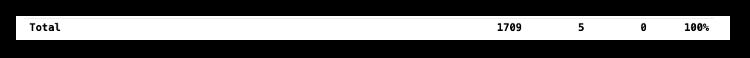
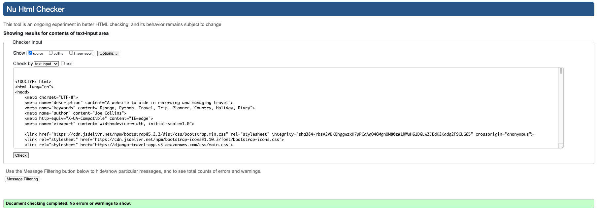

# Testing

Back to Readme [here](README.md)

# Table Of Contents

- [Python Unit Testing](#python-unit-testing)
- [HTML Validation Testing](#html-validation-testing)
- [CSS Validation Testing](#css-validation-testing)
- [JS Validation Testing](#js-validation-testing)
- [Python Validation Testing](#python-validation-testing)
- [Lighthouse Testing](#lighthouse-testing)
- [User Testing](#user-testing)

 

___

## Python Unit Testing

Unit Testing coverage rounded to 100%.

 
See below for details on each app:

      
Home App

   
Home app covered to 100%:

 

___

      
Diary App

Diary app covered to 100%:

 

___

      
To-Do List App

To-Do List app covered to 100%:

 

___

      
User Profile App

User Profile app covered to 100%:

 

___

      
Site Updates App

Site Updates app covered to 100%:

 

___

      
Travel App Views

Travel App Views covered to 78%:

Error pages 404 was unit tested and 403 was also covered by other unit testing.

Error pages 400 and 500 were not unit tested but were manually tested in User Tesing. 

In addition to unit testing error pages 404 and 403 were also tested manually in User Tesing.
 

___

      
Travel App Settings

Travel App Settings covered to 98%:

Unit testing was all run through sqlite3 and no access was granted for ElephantSQL therfore this line could not be covered.

 

___

      
Manage.py

Manage.py covered to 83%:

Unit testing did not cover except ImportError. This has no negative impact on functionality.

 

___

## HTML Validation Testing

See below html validation results for each page:

      
Home

 

Login:

___

Login Required:

___

Register:

___

Home:

___

Password Reset:

___

Password Email Sent

___

Password Reset Set Password

___

Password Reset Confirmation

___

      
Planner

 

Map:

___

Country Info:

___

Diary Posts:

___

Add / Update Diary:

___

Delete Diary:

___

Diary Tags:

___

      
To-Do List

 

Add To-Do List:

___

Update To-Do List:

___

To-Do List Items:

___

      
Profile

 

Profile:

___

Profile Update:

___

      
Site Updates

 

Site Updates:

___

Site Update Detail:

___

Add / Update Comment:

___

Delete Comment:

___

___

## CSS Validation Testing

      
Main

 

 

___

      
Login

 

 

___

      
White Background

 

 

___

      
Off-White Background

 

 

___

      
Site Update Grey Background

 

 

___

## JS Validation Testing

      
JSHint Validations

 
   
No Errors idendified in JSHint:

___

___

## Python Validation Testing

      
Home

 
   
Views:

___

URLs:

___

Forms:

___

      
Home Unit Tests

 
   
Views:

___

URLs:

___

Forms:

___

      
Diary

 
   
Views:

___

URLs:

___

Forms:

___

Models:

___

      
Diary Unit Tests

 
   
Views:

___

URLs:

___

Models:

___

      
Profile

 
   
Views:

___

URLs:

___

Models:

___

Signals:

___

Forms:

___

      
Profile Unit Tests

 
   
Views:

___

URLs:

___

Models:

___

      
Site Updates

 
   
Views:

___

URLs:

___

Models:

___

Forms:

___

      
Site Updates Unit Tests

 
   
Views:

___

URLs:

___

Models:

___

Forms:

___

      
To-Do List

 
   
Views:

___

URLs:

___

Models:

___

Forms:

___

      
To-Do List Unit Tests

 
   
Views:

___

URLs:

___

Models:

___

## Lighthouse Testing

      
All Lighthouse Scores

Login:

 

___

Register:

 

___

Profile:

 

___

Home:

 

___

Map:

 

___

Country Info:

 

___

Forms:

 

___

List Items:

 

___

Diary:

 

___

Diary Tags:

 

___

Site Updates:

 

___

Update Detail:

 

___

___

## User Testing

### User Stories Acceptance Criteria
Each User Story documented (as an issue) in the Project Iterations [here](https://github.com/Joe-Collins-1986?query=is%3Aclosed&tab=projects) has Acceptance Criteria documented on GitHub which needed to be achieved before marking the User Sory to complete.

To view these access the User Story Issues in Iterations 1-5

Example Screenshot of Iteration On GitHub:

Example Screenshot of User Story in Iteration:

### User Testing Checklist

In addition to the User Story Acceptance Criteria a checklist was developed to check each page after all features were developed prior to sharing project content.

To record this checklist [tabletomarkdown.com](https://tabletomarkdown.com/convert-spreadsheet-to-markdown/) was used to quickly convert data to Markdown Tables tables.

      
Navbar

 
   
| REF | TEST         | EXPECTATION                                                                      | Pass/Fail |
| --- | ------------ | -------------------------------------------------------------------------------- | --------- |
| A1  | Logo         | Directed to Home page if logged in, Login page in not.                           | P         |
| A2  | Home         | Directed to Home page if logged in, Login page in not.                           | P         |
| A3  | Planner      | Directed to Map page if logged in, Login Required page in not.                   | P         |
| A4  | Site Updates | Directed to Site Updates page if logged in or not.                               | P         |
| A5  | Login        | Only shown if user is not logged in. Direct to Login page.                       | P         |
| A6  | Register     | Only shown if user is not logged in. Direct to Register page.                    | P         |
| A7  | Profile      | Only shown if user is logged in. Direct to Profile page.                         | P         |
| A8  | Logout       | Only shown if user is logged in. Logs user out and directs to Login page.        | P         |
| A9  | Admin        | Only shown if user is logged in with a Superuser account. Directs to Admin page. | P         |

___

      
Footer/Menu Social Media Links

 
   
**Note:** The client is fictional and therefore the social sites do not exist so the footer links will only take the user to the overall social media site specified e.g. twitter.

| REF | TEST                      | EXPECTATION                                                                                                                 | Pass/Fail |
| --- | ------------------------- | --------------------------------------------------------------------------------------------------------------------------- | --------- |
| B1  | Facebook                  | Shows if logged in or not. Directed to Facebook - but not to client account as this does not exist.                         | P         |
| B2  | Instagram                 | Shows if logged in or not. Directed to Instagram - but not to client account as this does not exist.                        | P         |
| B3  | Twitter                   | Shows if logged in or not. Directed to Twitter - but not to client account as this does not exist.                          | P         |
| B4  | Pinterest                 | Shows if logged in or not. Directed to Pinterest - but not to client account as this does not exist.                        | P         |
| B5  | Expandable Menu Facebook  | Shows if logged in or not when menu is expanded. Directed to Facebook - but not to client account as this does not exist.   | P         |
| B6  | Expandable Menu Instagram | Shows if logged in or not when menu is expanded.  Directed to Instagram - but not to client account as this does not exist. | P         |
| B7  | Expandable Menu Twitter   | Shows if logged in or not when menu is expanded. Directed to Twitter - but not to client account as this does not exist.    | P         |
| B8  | Expandable Menu Pinterest | Shows if logged in or not when menu is expanded. Directed to Pinterest - but not to client account as this does not exist.  | P         |

___

      
Register

 
   
| REF | TEST                               | EXPECTATION                                                                 | Pass/Fail |
| --- | ---------------------------------- | --------------------------------------------------------------------------- | --------- |
| C1  | Blank Username                     | Notified field required.                                                    | P         |
| C2  | Pre-Existing Username              | Notified username already exists and new name needed.                       | P         |
| C3  | Invalid Username                   | Field highlighted and instruction text highlighted.                         | P         |
| C4  | Blank Email                        | Notified field required.                                                    | P         |
| C5  | Invalid Email                      | Notified why email is not acceptable.                                       | P         |
| C6  | Invalid Password                   | Notified why password is not acceptable.                                    | P         |
| C7  | Blank Confirmation                 | Notified field required.                                                    | P         |
| C8  | Non Matching Password Confirmation | Notified passwords do not match.                                            | P         |
| C9  | Sign Up Button                     | Submits the form - if valid directed to home. No additional login required. | P         |
| C10 | Sign In Link                       | Directed to Login Page.                                                     | P         |

___

      
Login and Login Required

 
   
| REF | TEST                  | EXPECTATION                                                                                                          | Pass/Fail |
| --- | --------------------- | -------------------------------------------------------------------------------------------------------------------- | --------- |
| D1  | Blank Username        | Notified field required.                                                                                             | P         |
| D2  | Blank Password        | Notified field required.                                                                                             | P         |
| D3  | Invalid Password/User | Notified password does not link to username.                                                                         | P         |
| D4  | Sign In Button        | Submits the form - if valid directed to home or the page the user tried to access when redirected to login required. | P         |
| D5  | Sign Up Link          | Directed to Register page.                                                                                           | P         |
| D6  | Password Reset        | Directed to Password Reset page.                                                                                     | P         |

___

      
Password Reset

 
   
Test the full Reset password process across all relevent pages.

| REF | TEST                                                  | EXPECTATION                                                                                                     | Pass/Fail                                                                                                                                                                                                                                                                                                                      |
| --- | ----------------------------------------------------- | --------------------------------------------------------------------------------------------------------------- | ------------------------------------------------------------------------------------------------------------------------------------------------------------------------------------------------------------------------------------------------------------------------------------------------------------------------------ |
| E1  | Email Blank                                           | Notified field required.                                                                                        | P                                                                                                                                                                                                                                                                                                                              |
| E2  | Invalid Email                                         | Notified why email is not acceptable.                                                                           | P                                                                                                                                                                                                                                                                                                                              |
| E3  | Sign Up Link                                          | Directed to Register page.                                                                                      | P                                                                                                                                                                                                                                                                                                                              |
| E4  | Email Success On Valid Email                          | Success Email Screen Shown.                                                                                     | P                                                                                                                                                                                                                                                                                                                              |
| E5  | Email Success page Password Reset Link                | Directed to back to password reset provide email page.                                                          | P                                                                                                                                                                                                                                                                                                                              |
| E6  | Email Success Sign Up Link                            | Directed to Login page.                                                                                         | P                                                                                                                                                                                                                                                                                                                              |
| E7  | Password Reset Email Received                         | Email with link to reset page is received and link directs to reset password page.                              | P - Note BT Internet has placed restriction against spam emails which can effect BT Internet email address oweners getting the reset email.  If this was to be established as a commercial website BT could be contacted and registered with to stop this occuring.  Other email providers worked fine in testing. |
| E8  | On Reset page Blank Password or Password Confirmation | Notified field required.                                                                                        | P                                                                                                                                                                                                                                                                                                                              |
| E9  | On Reset page Invalid Password                        | Notified why password is not acceptable.                                                                        | P                                                                                                                                                                                                                                                                                                                              |
| E10 | On Reset page Non Matching Password Confirmation      | Notified passwords do not match.                                                                                | P                                                                                                                                                                                                                                                                                                                              |
| E11 | Password Reset - Password Reset Button                | On successful completion button directs to Password Updated page with link to Login page Via Sign In Here link. | P                                                                                                                                                                                                                                                                                                                              |

___

      
Summary Site Updates

 
   
Summary Site Updates section that appears on the bottom of Register, Login, Login Required, Password Resets and Home pages.

| REF | TEST                     | EXPECTATION                                                                                                                                                 | Pass/Fail |
| --- | ------------------------ | ----------------------------------------------------------------------------------------------------------------------------------------------------------- | --------- |
| F1  | 3 Updates                | Page shows latest 3 updates.                                                                                                                                | P         |
| F2  | Hover on Update          | Update goes blue on hover.                                                                                                                                  | P         |
| F3  | Select Update Or Comment | If logged in directed to Update Detail page, if not logged in directed to Login Required page. Then after login go straight to Update Detail page. (See D4) | P         |
| F4  | See All Updates Button   | If logged in or not logged in direct to Site Updates posts page.                                                                                            | P         |

___

      
Home

 
   
| REF | TEST                 | EXPECTATION                                                                                                                                      | Pass/Fail |
| --- | -------------------- | ------------------------------------------------------------------------------------------------------------------------------------------------ | --------- |
| G1  | Parallax Image       | Parallax on image scroll. Content move at different speeds - moutains, trees, welcome text.                                                      | P         |
| G2  | Arrow Flash          | Arrow flashing on load to direct users to scroll.                                                                                                | P         |
| G3  | Planner Button       | If logged in planner button directs to Map page. If not logged in direcs to Login Required page then on completion directs to Map page. (See D4) | P         |
| G4  | Site Updates Section | See Summary Updates. F1-F4                                                                                                                       | P         |                                                                                          | P         |

___

      
Map

 
   
| REF | TEST                                     | EXPECTATION                                                                                                                                                                                 | Pass/Fail |
| --- | ---------------------------------------- | ------------------------------------------------------------------------------------------------------------------------------------------------------------------------------------------- | --------- |
| H1  | Hover Over Countries                     | The country name appears in the top right corner when hovering over the country on the map.                                                                                                 | P         |
| H2  | Select Map Country                       | Directs to Country Info page when a country is selected on the map.                                                                                                                         | P         |
| H3  | Country Dropdown Alphabetical            | All country dropdown country options appear in alphabetical order.                                                                                                                          | P         |
| H4  | Select Dropdown Country                  | Directs to Country Info page when a country is selected on all countries dropdown.                                                                                                          | P         |
| H5  | Country Status Updated - Map Update      | When a country status is updated on the Country Info page and the Map page is returned to the country on the map shows in a different colour - green- wish list or yellow - visited.        | P         |
| H6  | Country Status Updated - Dropdown Update | When a country status is updated on the Country Info page and the Map page is returned dropdowns appear for visited or wish list if the user has set these statuses on at least on country. | P         |
| H7  | Visit/Wish List Disappears               | If the user changes the status to no longer have any wish list or visited countries the respective dropdown will disappear.                                                                 | P         |
| H8  | Select Visit or Wish List Dropdown       | Directs to Country Info page when a country is selected on dropdowns.                                                                                                                       | P         |
| H9  | Pie Chart Shows Header                   | Shows percentage visited. Does not account for wish list.                                                                                                                                   | P         |
| H10 | Pie Chart                                | Pie Chart reflects the number of wish lists, visited and not visted countries with the respective colour to align with the legend.                                                          | P         |
| H11 | Pie Chart - Small Screen                 | The Pie Chart disappears for small screens.                                                                                                                                                 | P         |

___

      
Country Info

 
   
| REF | TEST                        | EXPECTATION                                                                                                                                                    | Pass/Fail |
| --- | --------------------------- | -------------------------------------------------------------------------------------------------------------------------------------------------------------- | --------- |
| I1  | Back Button                 | The globe icon on the top left of the screen is fixed to always show and directs back to the Map page.                                                         | P         |
| I2  | Country Flag                | The country selected shows the correct flag.                                                                                                                   | P         |
| I3  | Header Image                | The country selected shows the correct header image.                                                                                                           | P         |
| I4  | About                       | The country selected shows the correct about info.                                                                                                             | P         |
| I5  | Info Stats                  | The country selected shows the correct info stats (Capital, Currency, Language, Population).                                                                   | P         |
| I6  | Visited Selected            | Visited form defaults to 'Not Visited' until the user selects a status for the country and provides a dropdown list of 'Not Visited', 'Visited' & 'Wish List'. | P         |
| I7  | Visited Selected Re-Visited | The status remains from previous selection when re-visited the country.                                                                                        | P         |
| I8  | Visited Selected Submit     | When visited is selected and submitted the page returns to the visited status form and shows the applied status.                                               | P         |
| I9  | Visited Updates Map Colour  | See H5.                                                                                                                                                        | P         |
| I10 | Add To-Do List              | Add To-Do List button directs to Add To-Do List form.                                                                                                          | P         |
| I11 | Select To-Do List Title     | Directs to task To-Do List Item Manager page.                                                                                                                  | P         |
| I12 | Edit To-Do List             | Add To-Do List button directs to Add To-Do List form.                                                                                                          | P         |
| I13 | To-Do List Order            | To Do Lists are ordered by created date. The order is not ammended by update.                                                                                  | P         |
| I14 | Delete To-Do List           | Deletes To-Do List  and returns to the To-Do List  section. No confirmation required.                                                                          | P         |
| I15 | View Diary Button           | Directs to the Diary page.                                                                                                                                     | P         |

___

      
Add To-Do List Form / Edit To-Do List Form

 
   
| REF | TEST                 | EXPECTATION                                                                                                                                                       | Pass/Fail |
| --- | -------------------- | ----------------------------------------------------------------------------------------------------------------------------------------------------------------- | --------- |
| J1  | Title Blank          | Notified field required.                                                                                                                                          | P         |
| J2  | Description Optional | Form can be submitted with or without a description.                                                                                                              | P         |
| J3  | Cancel Button        | Directs back to Country Info page for correct country and navigates back to To-Do List section.                                                                   | P         |
| J4  | Submit Button        | On valid form - adds/edits To-Do List and directs back to Country Info page for correct country and navigates back to To-Do List section showing new/edited list. | P         |
| J5  | Edit To-Do List      | Existing content is populated in fields.                                                                                                                          | P         |

___

      
To-Do List Items Manager

 
   
| REF | TEST                            | EXPECTATION                                                                                              | Pass/Fail |
| --- | ------------------------------- | -------------------------------------------------------------------------------------------------------- | --------- |
| K1  | Title                           | Title is for the selected To-Do List.                                                                    | P         |
| K2  | Description                     | Description is for the selected To-Do List. If no description added only the title shows.                | P         |
| K3  | Add New Task Form - Blank Entry | Notified field required.                                                                                 | P         |
| K4  | Back Button                     | Directs back to Country Info page for correct country and navigates back to To-Do List section.          | P         |
| K5  | Add Button                      | Creates a item and presents it at the top to the page.                                                   | P         |
| K6  | List Item Order                 | List items presented in the order they were created.                                                     | P         |
| K7  | Close Button On Item            | Put a line through the item title, darkens the item box and moves the item  below the open items.        | P         |
| K8  | Open Button On Item             | Resets the original formatting and moves the item back to it's original position above all closed items. | P         |
| K9  | Delete Button On Item           | Deletes the item. No confirmation required.                                                              | P         |

___

      
Diary Posts

 
   
| REF | TEST                     | EXPECTATION                                                                                                                                                                                            | Pass/Fail |
| --- | ------------------------ | ------------------------------------------------------------------------------------------------------------------------------------------------------------------------------------------------------ | --------- |
| L1  | Add Diary Post Button    | Directs to Diary Post Form page.                                                                                                                                                                       | P         |
| L2  | Country Info Button      | Directs back to Country Info page for the correct country and navigates back to the diary section.                                                                                                     | P         |
| L3  | Posts Paginated          | Each page only shows two diary posts. Pagination navigation is presented at the bottom of the page if there are more than two posts. This navigation allows specific page selection or next, previous. | P         |
| L4  | Search Posts Input Field | Diary posts are filtered to any diary posts where the title, content or tag include the input.                                                                                                         | P         |
| L5  | Search Tags              | Directs to the Tags page.                                                                                                                                                                              | P         |
| L6  | Pagiation On Filter      | The pagination applies to the filtered searches. The filter remains when using the pagination navigation at the bottom of the page.                                                                    | P         |
| L7  | Refresh Icon             | The refresh icon resets all filters to show all posts.                                                                                                                                                 | P         |
| L8  | Date Post Created        | The post shows the date created in the top left. This is not amended with any future post updates. Date shows in short format.                                                                         | P         |
| L9  | Experience Icon          | The expereince of the post is represented as an emoji. Selecting this emoji will filter the posts to the experience selected.                                                                          | P         |
| L10 | No Experience Icon       | If no experence is entered on the post then no emoji will show.                                                                                                                                        | P         |
| L11 | Content                  | Content is shown in the body of the post. Line spacing is reflected.                                                                                                                                   | P         |
| L12 | Image                    | Image is shown in the body of the post if it exists. This is optional and does not need to be added.                                                                                                   | P         |
| L13 | Tags                     | If tags are added to the post they are reflected at the bottom of the post in uppercase. These can be selected on the post to filter to any posts with that tag.                                       | P         |
| L14 | No Tags                  | If not tag is added to a post a NO_TAGS tag is applied. Selecting this tag will filter to all posts with NO_TAGS tags.                                                                                 | P         |
| L15 | Update                   | Directs to Diary Post Form page.                                                                                                                                                                       | P         |
| L16 | Delete                   | Directs to Diary Post Delete Confirmation page.                                                                                                                                                        | P         |

___

      
Diary Forms

 
   
| REF | TEST                                     | EXPECTATION                                                                   | Pass/Fail |
| --- | ---------------------------------------- | ----------------------------------------------------------------------------- | --------- |
| M1  | Content Blank                            | Notified field required.                                                      | P         |
| M2  | Content                                  | Allows content to be entered in paragraphs with spacing.                      | P         |
| M3  | Image                                    | Allows user to select image from their system and add it. This is optional.   | P         |
| M4  | Tags                                     | Allow user to add multiple tags. This is optional.                            | P         |
| M5  | Exp Rating                               | Can select from a dropdown list of experiences.                               | P         |
| M6  | Edit Post                                | Form prepopulates with previous post entries.                                 | P         |
| M7  | Image - Edit                             | Allows user to clear previous image or replace image with a new image.        | P         |
| M8  | Submit                                   | On valid form - Adds / edits diaty post and directs back to Diary Posts page. | P         |
| M9  | Cancel                                   | Directs back to Diary Posts page.                                             | P         |
| M10 | Delete Confirmation Form - Delete Button | Deletes post and directs back to Diary Posts page.                            | P         |
| M11 | Delete Confirmation Form - Cancel Button | Directs back to Diary Posts page.                                             | P         |

___

      
Diary Tags

 
   
| REF | TEST                       | EXPECTATION                                                                                                                                                  | Pass/Fail |
| --- | -------------------------- | ------------------------------------------------------------------------------------------------------------------------------------------------------------ | --------- |
| N1  | Back Button                | Directs back to Diary Posts page.                                                                                                                            | P         |
| N2  | Tags                       | Tags appear in the order of popularity. The number of times used in represented next to the tag name.                                                        | P         |
| N3  | Tags Duplication           | Tags added with the same text but different capitalised characters do not duplicate but are represented as the same tag and add to the number of times used. | P         |
| N4  | Tags Duplication Same Post | If the saem tags are used in a single post they are amalgamated to 1 tag regardless of case sensitivity.                                                     | P         |
| N5  | Select Tag                 | Selecting a tag will direct user to the Diary Posts page filtered to the tag selected.                                                                       | P         |

___

      
Site Updates

 
   
| REF | TEST                       | EXPECTATION                                                                                                                                                                                                    | Pass/Fail |
| --- | -------------------------- | -------------------------------------------------------------------------------------------------------------------------------------------------------------------------------------------------------------- | --------- |
| O1  | Title                      | The title on the page shows the number of posts returned.                                                                                                                                                      | P         |
| O2  | Search Updates Input Field | Site Update posts are filtered to any posts where the title, content or topic include the input.                                                                                                               | P         |
| O3  | Topics Dropdown            | Selecting the arrow in the search area opens up a list of the topics assigned to the Site Updates.                                                                                                             | P         |
| O4  | Topics Selection           | Selecting a topic filters the posts to that topic.                                                                                                                                                             | P         |
| O6  | Pagination                 | Each page only shows five Site Update posts. Pagination navigation is presented at the bottom of the page if there are more than five posts. This navigation allows specific page selection or next, previous. | P         |
| O7  | Pagiation On Filter        | The pagination applies to the filtered searches. The filter remains when using the pagination navigation at the bottom of the page.                                                                            | P         |
| O8  | Post Header                | The Header shows the Topic, title and posted date.                                                                                                                                                             | P         |
| O9  | Post Body                  | The body shows the content and image (if an image was added).                                                                                                                                                  | P         |
| O10 | Post Footer                | The footer shows the number of comments added to the post. If there are no comments the comment icon is clear, if there are comments in is solid.                                                              | P         |
| O11 | Post Hover                 | Post will highlight in blue when hovered over.                                                                                                                                                                 | P         |
| O12 | Select Post                | If Logged in directed to Update Detail page, if not logged in directed to Login Required page. Then after login go straight to Update Detail page. (See D4)                                                    | P         |

___

      
Site Update Detail

 
   
| REF | TEST                                          | EXPECTATION                                                                                                                                                                       | Pass/Fail |
| --- | --------------------------------------------- | --------------------------------------------------------------------------------------------------------------------------------------------------------------------------------- | --------- |
| P1  | Post                                          | The post information shows at the top of the page.                                                                                                                                | P         |
| P2  | Large Screen Add Comment Form                 | On a large screen the comment form is presented on the right of the screen.                                                                                                       | P         |
| P3  | Large Screen Comment Form - Title Blank       | Notified field required.                                                                                                                                                          | P         |
| P4  | Large Screen Add Comment Form - Comment Blank | Notified field required.                                                                                                                                                          | P         |
| P5  | Large Screen Add Comment Form - Image         | User can select images from system. This is optional.                                                                                                                             | P         |
| P6  | Large Screen Add Comment Form - Submit        | If form valid submit adds a comment to the page.                                                                                                                                  | P         |
| P7  | Site Updates Button                           | Directs back to Site Updates page.                                                                                                                                                | P         |
| P8  | Add Comment Button                            | This button only appears on a small screen. Directs to Comment Form page.                                                                                                         | P         |
| P9  | Comments                                      | Comments displayed on the bottom of the page in the order they are created.                                                                                                       | P         |
| P10 | Comments Header                               | Comments header displays title and posted date and the author. If an update has been made to the post by the user or the Administrator then the post also shows the updated date. | P         |
| P11 | Comments Body                                 | Comments body shows the comment added as well as an image if an image has been added.                                                                                             | P         |
| P12 | Comments Footer - Not Author                  | The comment footer does not appear if the user is not the author of the comment.                                                                                                  | P         |
| P13 | Comments Footer - Author                      | If the user is the author of the comment the footer of the comment will appear and present the update and delete buttons.                                                         | P         |
| P14 | Comments Footer - Update                      | Directs to Comment Form page.                                                                                                                                                     | P         |
| P15 | Comments Footer - Delete                      | Directs to Confirm Comment Deletion page.                                                                                                                                         | P         |
| P16 | Admin Response                                | When an administrator responds to a comment it appears in light yellow in the body of the comment.                                                                                | P         |

___

      
Comment Forms

 
   
| REF | TEST                              | EXPECTATION                                                        | Pass/Fail |
| --- | --------------------------------- | ------------------------------------------------------------------ | --------- |
| Q1  | Title Blank                       | Notified field required.                                           | P         |
| Q2  | Comment Blank                     | Notified field required.                                           | P         |
| Q3  | Image                             | User can select images from system. This is optional.              | P         |
| Q4  | Submit Button                     | If form valid submit adds a comment to the page.                   | P         |
| Q1  | Cancel Button                     | Directs Back to Update Detail page.                                | P         |
| Q2  | Edit Form                         | Pre-populates with fields previously entered.                      | P         |
| Q3  | Delete Confirmation Delete Button | Deletes the comment and navigates back to Site Update Detail page. | P         |
| Q4  | Delete Confirmation Cancel Button | Directs Back to Update Detail page.                                | P         |

___

      
Profile

 
   
| R1 | Default Set Up     | On Registration a skeleton profile is set up with a placeholder round profile image. This page shows user name and email and a default background of Paris. | P |
| -- | ------------------ | ----------------------------------------------------------------------------------------------------------------------------------------------------------- | - |
| R2 | Default Objectives | Before objectives are added the objectives section will show 'Currently you have no travel objectives set.'                                                 | P |
| R3 | Default Wish List  | Before wish list is set on any country the wish list  section will show 'Currently you have no countries on your wish list.'                                | P |
| R4 | Profile Image      | Once profile image added. This will show in replacement of the default profile image.                                                                       | P |
| R5 | Travel Objectives  | Once travel objectives are added they will show in the Travel Objectives section.                                                                           | P |
| R6 | Wish List          | Once a country is set to have a wish list status it will appear in the wish list section.                                                                   | P |
| R7 | Wish List Link     | The wish lists shown in the wish list section will direct to the Country Info page for that country.                                                        | P |
| R8 | Backgound Image    | The background image selected will replace the default Paris background.                                                                                    | P |
| R9 | Update Button      | Directs to the Profile Update page.                                                                                                                         | P |

___

      
Profile Update

 
   
| REF | TEST                                        | EXPECTATION                                                                                             | Pass/Fail |
| --- | ------------------------------------------- | ------------------------------------------------------------------------------------------------------- | --------- |
| S1  | Pre-population From User Model Registration | Registration will pre-populate username and email as per registration. These can be updated in profile. | P         |
| S2  | Pre-Population Default                      | Default profile image and background set. These can be updated in profile.                              | P         |
| S3  | Username blank                              | Notified field required.                                                                                | P         |
| S4  | Email blank                                 | Notified field required.                                                                                | P         |
| S5  | Profile Image                               | Allows user to select image from their system and add it in replacement of default.                     | P         |
| S6  | Travel Objectives                           | Allows users to set travel objectives.                                                                  | P         |
| S7  | Background Image                            | Allows user to select image from set options in replacement of default.                                 | P         |
| S8  | Submit Button                               | On valid form, update profile and direct back to Profile page.                                          | P         |
| S9  | Cancel Button                               | Direct back to Profile page.                                                                            | P         |

___

      
Admin

 

All models are currently registered with Django Administration. Once the client signs off on the go live all models will have the admin registration removed with the exception of the Site Update Models and the Profile Model.

As a result of this, only the Site Update Models and Profile Model were User Tested.
   
| REF | TEST                       | EXPECTATION                                                                     | Pass/Fail |
| --- | -------------------------- | ------------------------------------------------------------------------------- | --------- |
| T1  | Update Category Registered | Check Update Category pulled through to Django Administration.                  | P         |
| T2  | CRUD Category              | Admin can add, update or delete categories. Built in Django Functionality.      | P         |
| T3  | Updates  Registered        | Check Updates pulled through to Django Administration.                          | P         |
| T4  | CRUD Updates               | Admin can add, update or delete Site Updates. Built in Django Functionality.    | P         |
| T5  | Update Comments Registered | Check Update Comments pulled through to Django Administration.                  | P         |
| T6  | Filter Update Comments     | Admin can filter Update Comments by Comment Status.                             | P         |
| T7  | CRUD Update Comments       | Admin can add, update or delete Update Comments. Built in Django Functionality. | P         |
| T8  | Profile Registered         | Check Profile pulled through to Django Administration.                          | P         |
| T9  | CRUD Profile               | Admin can add, update or delete Profiles. Built in Django Functionality.        | P         |

___

